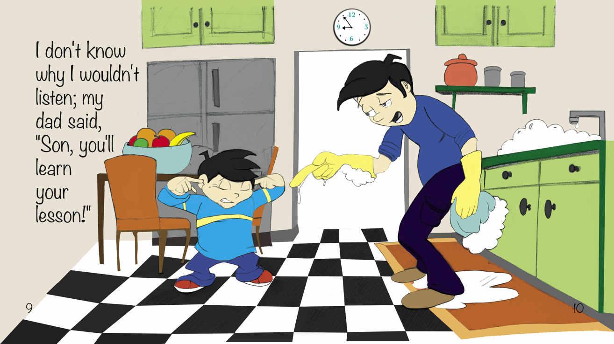
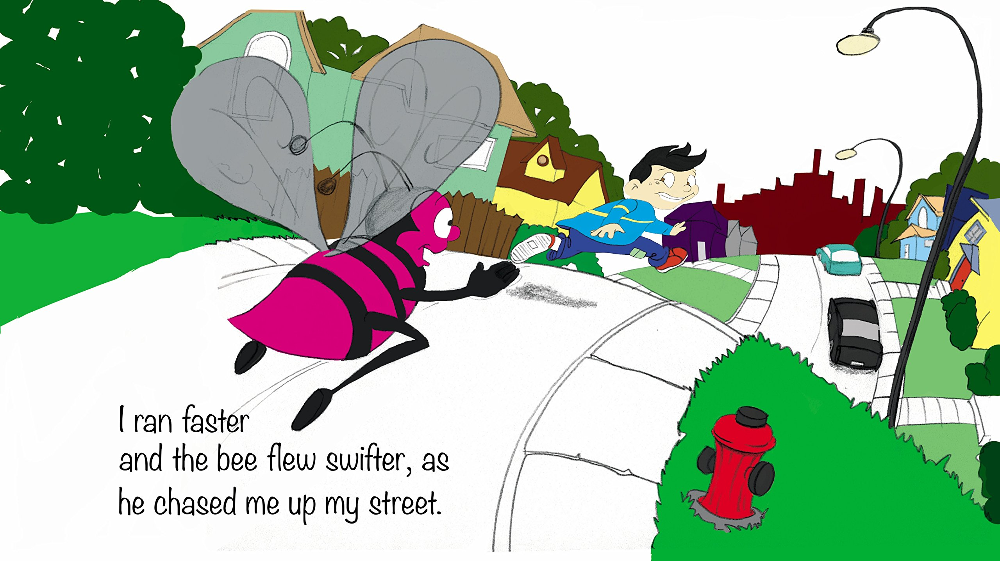
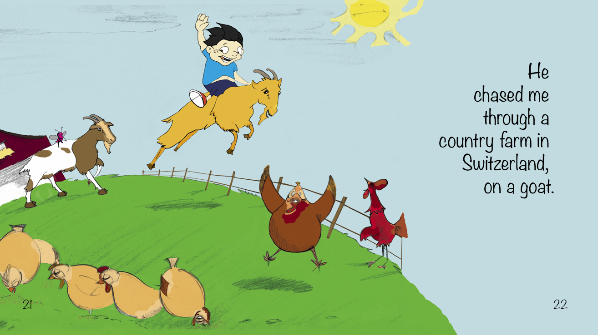
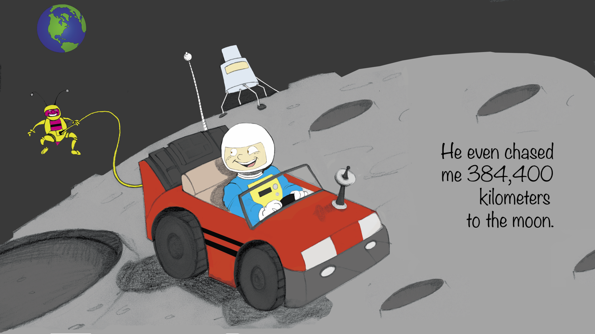
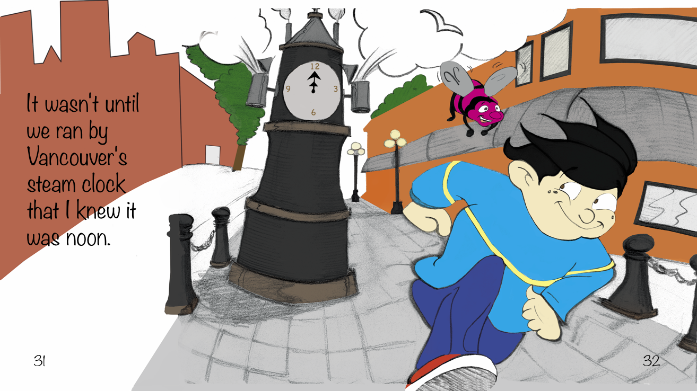

If you enjoy adventure, traveling and the exciting thrill of a chase, you'll love this book. This anti-bullying story is about a boy who has taunted and teased Mr. Beeze one too many times before the pink bee decides enough is enough. Impress the morality of acceptance and principles concerning the distinction between right and wrong, as your child explores the world through the enthusiasm of a chase in this exciting and educational journey. Take your child on an adventure with the peace of mind that they are reading with an eco-friendly and non-toxic book.

