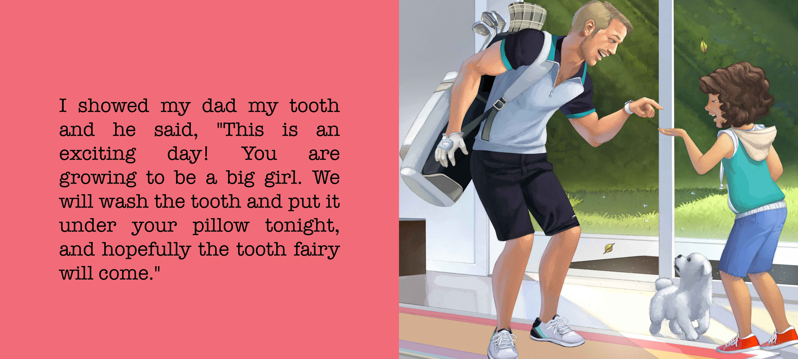
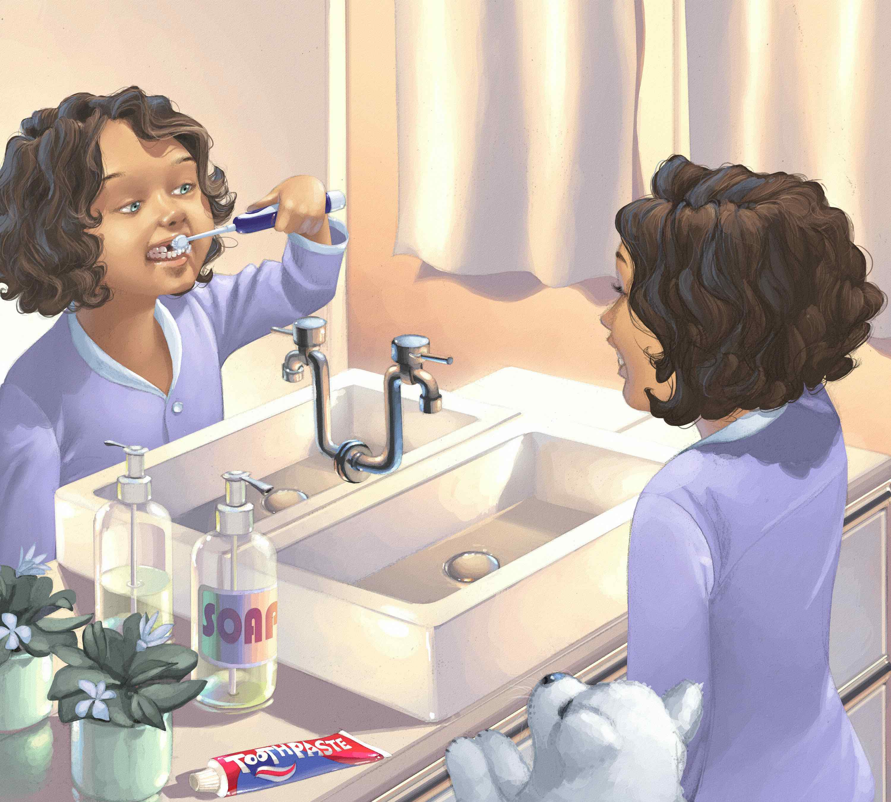
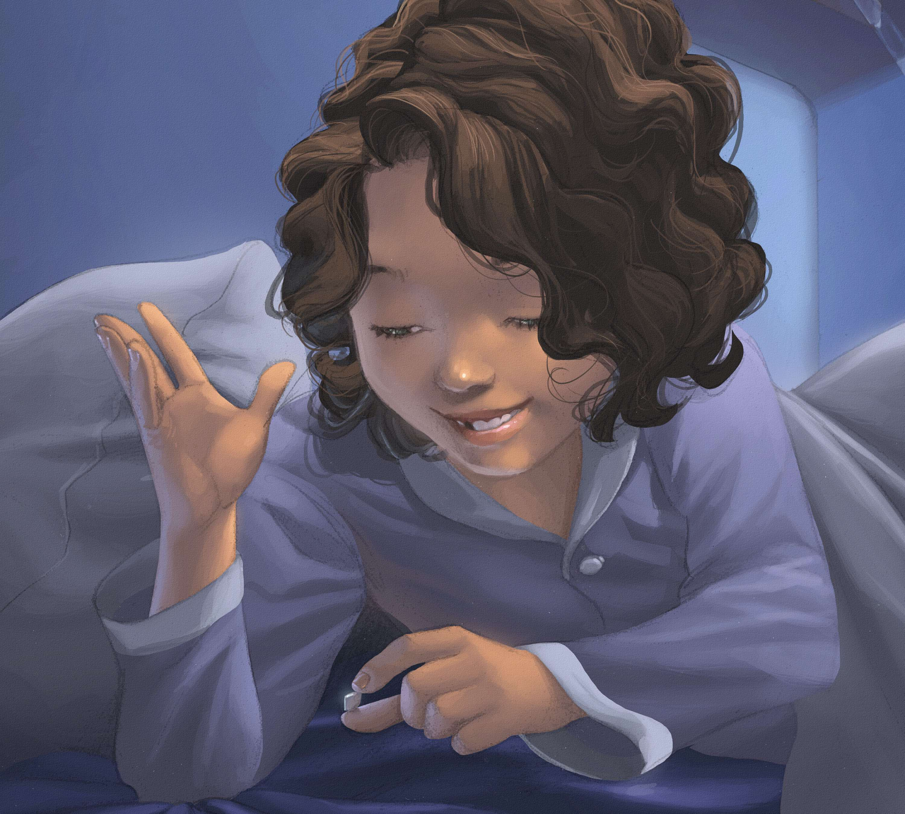
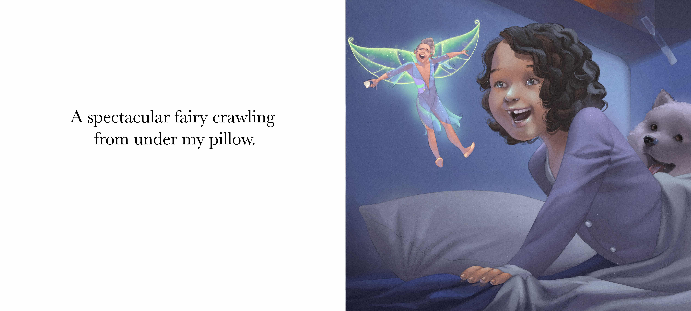

**New in December 2022**

First of Many is about a young girl who loses her first tooth. Her excitement takes her throughout the day expressing her great news to her family members. Each one has words of wisdom, with a comical insight and a catchy phrase. The story includes the classic, although non-traditional looking tooth fairy. 

> "Good morning, young child, I didn't mean to wake you; I am taking your tooth that you have left for me. Your tooth is a gem, as I see you have been brushing it well. I hope you brush the tooth that will grow in its place the same. I have left you something to show you how thankful I am." The tooth fairy said. 

Children usually lose their first tooth around 5 or 6 years old, and their front teeth will often be the first to fall out. This will be the first of many and children will appreciate understanding the developmental process and the importance of dental hygiene, while going on a fun family journey.

 

